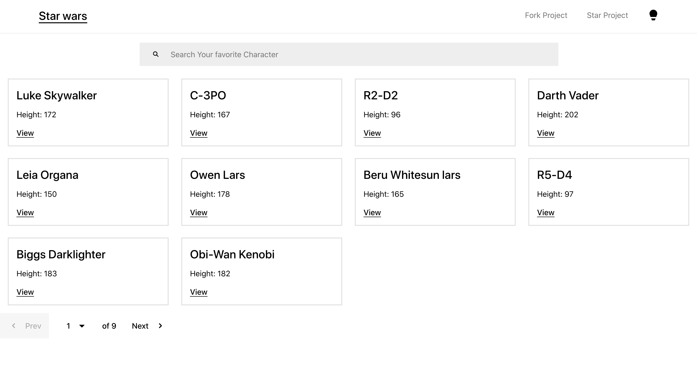
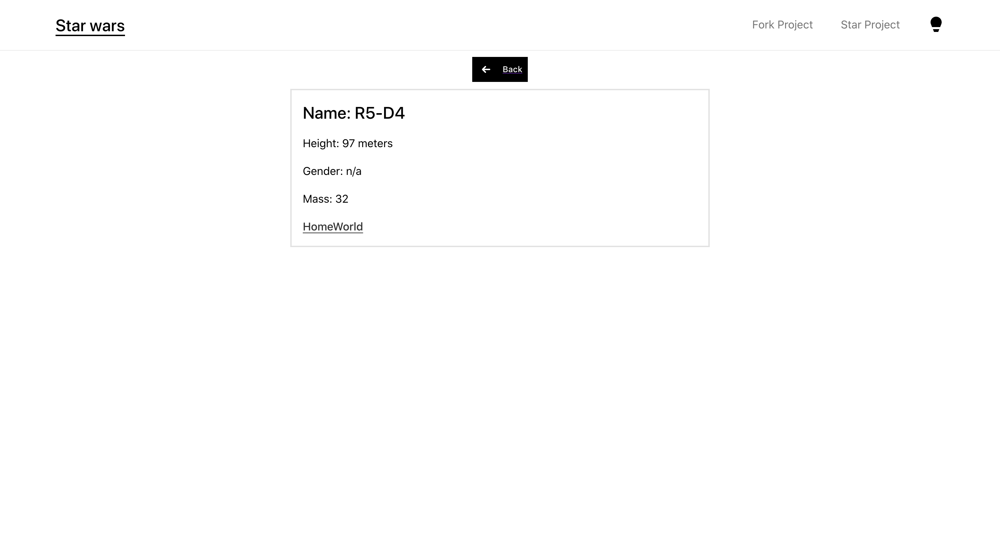
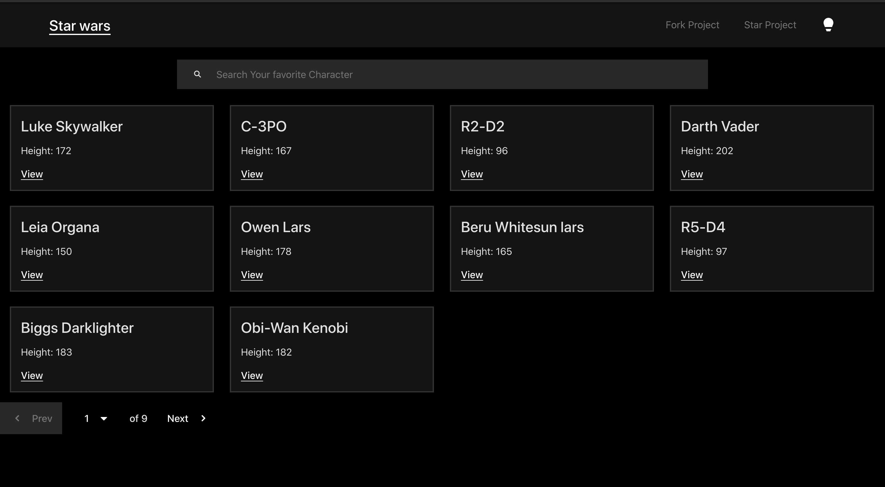
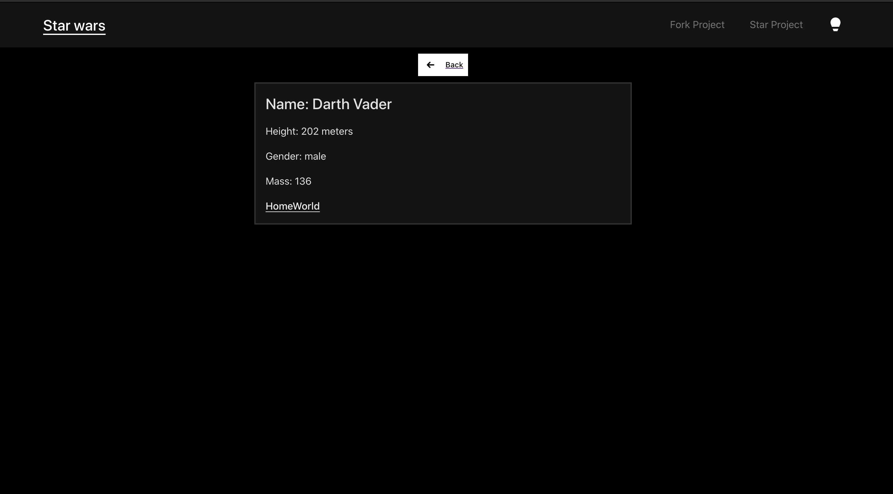

<!--
*** Thanks for checking out the Best-README-Template. If you have a suggestion
*** that would make this better, please fork the repo and create a pull request
*** or simply open an issue with the tag "enhancement".
*** Thanks again! Now go create something AMAZING! :D
-->


<!-- PROJECT SHIELDS -->
<!--
*** I'm using markdown "reference style" links for readability.
*** Reference links are enclosed in brackets [ ] instead of parentheses ( ).
*** See the bottom of this document for the declaration of the reference variables
*** for contributors-url, forks-url, etc. This is an optional, concise syntax you may use.
*** https://www.markdownguide.org/basic-syntax/#reference-style-links
-->


<!-- PROJECT LOGO -->
<br />
<p align="center">


<h3 align="center">Star Wars Viewer</h3>

  <p align="center">
    An Star wars view application
    <br />

[comment]: <> (    <a href="https://github.com/othneildrew/Best-README-Template"><strong>Explore the docs »</strong></a>)

[comment]: <> (    <br />)

[comment]: <> (    <br />)

[comment]: <> (    <a href="https://github.com/othneildrew/Best-README-Template">View Demo</a>)

[comment]: <> (    ·)

[comment]: <> (    <a href="https://github.com/othneildrew/Best-README-Template/issues">Report Bug</a>)

[comment]: <> (    ·)

[comment]: <> (    <a href="https://github.com/othneildrew/Best-README-Template/issues">Request Feature</a>)

[comment]: <> (  </p>)
</p>


<!-- ABOUT THE PROJECT -->
## About The Project

This is a small Star wars project that consumes [SWAPI DEV API](https://swapi.dev/api/people) to query a variety of star wars characters

Includes features like
* View all star wars Characters
* Get Details for a single Star wars character
* Search Star war character by name


### Built With

* [TypeScript](https://www.typescriptlang.org/)
* [Node JS](https://nodejs.org/)
* [React](https://reactjs.org/)
* [Base Web ](baseweb.design)
* [GraphQL with Apollo](apollographql.com/docs/)
* [Express js](https://expressjs.com/)
* [Jest](http://jestjs.io/docs/)
* [Test Render](https://reactjs.org/docs/test-renderer.html)


<!-- GETTING STARTED -->
## Getting Started

To get a local copy up and running follow these simple example steps.

### Prerequisites

This is an example of how to list things you need to use the software and how to install them.
* Node >= v 12
  
    Download Node from [here](https://nodejs.org/en/) 
  ```sh
  npm install npm@latest -g
  ```

### Installation

1. Clone the repo
   ```sh
   git clone https://github.com/MuhweziDeo/star-wars.git
   ```
2. Install NPM packages for client
    ```sh
   cd client/
   ```
   ```sh
   npm install
   ```

3. Install NPM packages for Server
    ```sh
   cd server/
   ```
   ```sh
   npm install
   ```
4. Start Client and Server in different terminals
   
   Server
   ```sh
   cd server/
   ```
     ```sh
   npm run start:dev
   ```
   Client

     ```sh
   cd client/
   ```
     ```sh
   npm  start
   ```
5. Access the Applications on urls
    
    Server -  [http://localhost:5000/graphql](http://localhost:5000/graphql)
   
   Frontend - [http://localhost:3000](http://localhost:3000)


6. Tests 

    ##### client
    
    ```sh 
    cd client/
    npm run test
     ```
    
    #### Server

    ```sh 
    cd server/
    npm run test
    ```
<!-- USAGE EXAMPLES -->
## Usage

<p>

<br>

<br>

<br>

<br>
</p>


<!-- LICENSE -->
## License

Distributed under the MIT License. See `LICENSE` for more information.


<!-- CONTACT -->
## Contact

Your Name - Muhwezi Deo 

Project Link: [https://github.com/MuhweziDeo/star-wars](https://github.com/MuhweziDeo/star-wars)


<!-- MARKDOWN LINKS & IMAGES -->
<!-- https://www.markdownguide.org/basic-syntax/#reference-style-links -->


